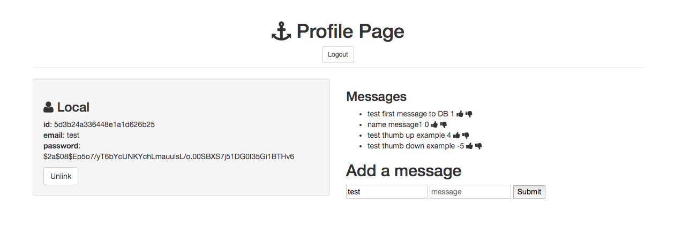

# Task Manager Full-stack App

### Goal: Create a full-stack message board with user authentication.

## Design and Development:
**Tech Used** HTML, CSS, JavaScript, Node, Express, EJS template, MongoDB, User Authentication:
Using Node, Express, JS, and MongoDB to store and access data, this app allows users to post messages to a fan board. Upon logging into your profile, you can thumbs up, thumbs down, or delete messages. Showing thumbs up and thumbs down number doesn't show individual count but total amount. 

## Reflections:
I learned so much about building a full-stack application and how the different routes and files are interconnected.

## Installation
1. Clone repo
2. run `npm install`

## Usage
1. run `node server.js`
2. Navigate to `localhost:3330`

## Credit
Modified from Scotch.io's auth tutorial

## Important
create database.js file with: module.exports = { 'url' : '', // looks like mongodb://:@mongo.onmodulus.net:27017/Mikha4ot 'dbName': '' };
